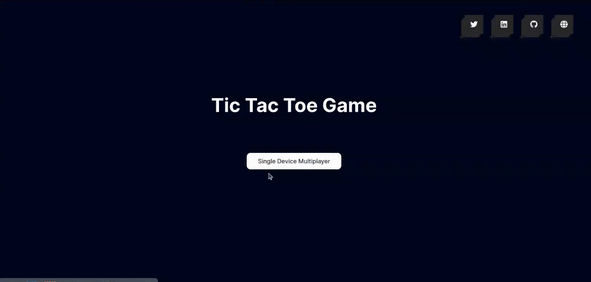

# Tic Tac Toe Game In React



## Unique Features:

1. More Tiles, More Fun! <br>Option to choose to play on a classic 3x3 board, spice things up with a 4x4 challenge, or go all-in for a brain-bending 5x5 experience. More tiles, more fun – you're in control!<br> <br>

2. The 10-Second Countdown! <br>Every move only have 10 seconds. if player take too long, move gets tossed into a random spot – can you beat the clock? 🕐💨<br><br>

3. History Feature: Rewind and Replay!<br>With the History Feature, players can look back at every move they have made, go back to any point, and redo the moves. But, if any changes happen on the previous move, anything after that point is wiped out.<br><br>

4. Prevent Page Leave: No Escape Until Victory!<br>In the middle of the game, can't leave the page. If tries This feature throws up a popup and will have to verify the page leave.<br><br>

## Technologies

```
"dependencies": {
    "@fortawesome/fontawesome-svg-core": "^6.4.2",
    "@fortawesome/free-brands-svg-icons": "^6.4.2",
    "@fortawesome/free-solid-svg-icons": "^6.4.2",
    "@fortawesome/react-fontawesome": "^0.2.0",
    "gh-pages": "^6.0.0",
    "history": "^5.3.0",
    "rc-pagination": "^3.7.0",
    "react": "^18.2.0",
    "react-dom": "^18.2.0",
    "react-router-dom": "^6.15.0",
    "react-toastify": "^9.1.3",
    "reactjs-popup": "^2.0.6"
  },
```

Live Demo 1 : https://tic-tac-toe-virid-eight.vercel.app/

Live Demo 2 : https://robiulhr.github.io/Tic-Tac-Toe/
